# :movie_camera: 영화 추천 사이트 만들기

# :seedling: 윤병준, 오채명

[TOC]

<br>

## 1. 구성

|      |  이름  | 역할 분담                              |
| :--: | :----: | -------------------------------------- |
| 팀장 | 윤병준 | Back-end(55%)/Front-end(45%) : Django  |
| 팀원 | 오채명 | Front-end(55%)/Back-end(45%) : Vue/Cli |

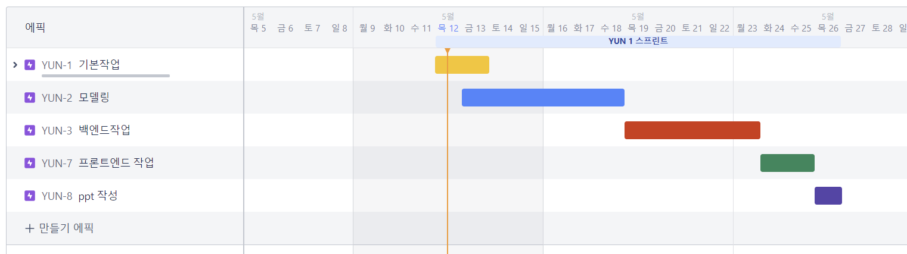

### 1. 개발 환경

* Django 
* Vue/Cli 
* UX/UI : figma
* 협업 툴 : JIRA

###  2. 부가기능

#### 1. accounts

* 로그인
* 로그아웃
* 회원가입
* 회원탈퇴
* 개인 프로필 - `profile`
  * 회원정보수정
  * 비밀번호 수정
  * 봐야할 영화 ToWatchList

#### 2. movies

`movies`

* 전체 영화 리스트
* 사용자별 영화 추천 기능
  
  1. 런타임이 1시간 이하인 영화 가져오기    
  2. 런타임이 2.5시간 이상인 영화 가져오기
  3. vote_average가 8점 이상인 영화만 가져오기
  4. 현재 시간과 어울리는 영화 가져오기
  

```python
# 추천 알고리즘
@api_view(['POST'])
def recommend(request): 
    # me_like = request.data.get('me_like')

    movies = get_list_or_404(Movie)
    serializer = MovieSerializer(movies, many=True)
    # pprint(serializer.data)


    ## 1. 런타임이 1시간 이하인 영화 가져오기    
    short_movies = []
    for movie in serializer.data:
        # print(movie['vote_average'])
        # print(movie['runtime'])
        # print(movie['pk'])
        if movie['runtime'] < 60 :
            movie_pick= get_object_or_404(Movie, pk=movie['pk'])
            short_movies.append(movie_pick)
            short_movies_serializer = MovieSerializer(short_movies, many=True)
    
    ## 2. 런타임이 2시간 이상인 영화 가져오기
    long_movies = []
    for movie in serializer.data:
        if movie['runtime'] > 150:
            movie_pick = get_object_or_404(Movie, pk=movie['pk'])
            long_movies.append(movie_pick)
            long_movies_serializer = MovieSerializer(long_movies, many=True)

    ## 3. vote_average가 8점 이상인 영화만 가져오기
    high_vote_movies = []
    for movie in serializer.data:
        if movie['vote_average'] >= 8 :
            movie_pick= get_object_or_404(Movie, pk=movie['pk'])
            high_vote_movies.append(movie_pick)
            high_vote_movies_serializer = MovieSerializer(high_vote_movies, many=True)

    ## 4. 현재 시간과 어울리는 영화 가져오기
    now_time_movies = []
    dt = datetime.now().hour
    # 09 ~ 15 / 액션, 코미디, 다큐, 로맨스, TV영화, 전쟁, 서부, 드라마
    if 9 <= dt < 15 or 21 <= dt < 23 or 0 <= dt < 5:
        now_genres=[28, 35, 99, 10749, 10770, 10752, 37, 18]
    # 16 ~ 21 / 애니매이션, 모험, 판타지, SF, 음악
    elif 5 <= dt < 9 or 15 <= dt < 21:
        now_genres=[16, 12, 14, 878, 10402]

    for movie in serializer.data:
        if movie['genre'][0] in now_genres:
            movie_pick = get_object_or_404(Movie, pk=movie['pk'])
            now_time_movies.append(movie_pick)
            now_time_movies_serializer = MovieSerializer(now_time_movies, many=True)

    return Response([short_movies_serializer.data, long_movies_serializer.data, high_vote_movies_serializer.data, now_time_movies_serializer.data])
```

`movie.detail`

* 영화별 디테일 페이지
  * 이 영화와 비슷한 영화 추천 (장르로 접근)
  * 영화 좋아요 기능
  * 영화별 리뷰 작성(1:N관계) - Reviews
    * 리뷰 기능
    * 리뷰 수정
    * 리뷰 삭제
    * 리뷰 작성자 프로필로 넘어가기

#### 3. article

* 일반 게시글 작성 기능
  * 게시글 삭제
  * 게시글 수정
  * 게시글 작성자 프로필로 넘어가기
* 댓글 작성 기능
  * 댓글 삭제
  * 댓글 수정

### 3. API

1. TMDB
2. https://developers.themoviedb.org/3/movies/get-movie-watch-providers

### 4. color

*  https://colorhunt.co/ 참고


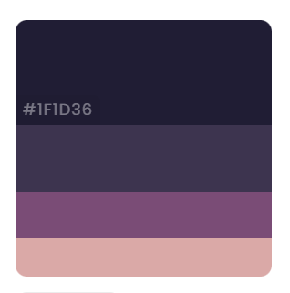

```tex
1F1D36
3F3351
864879
E9A6A6
```

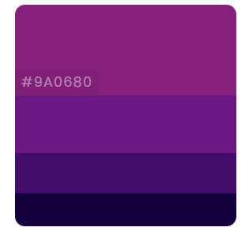

```tex
9A0680
79018C
4C0070
160040
```

### 5. 디자인 시안


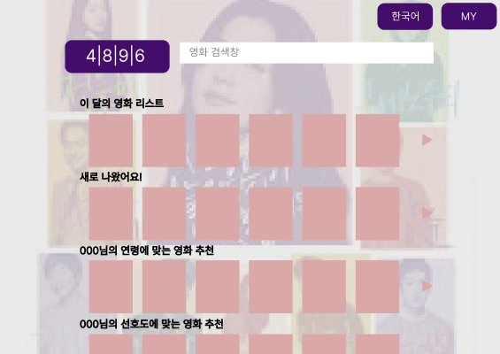


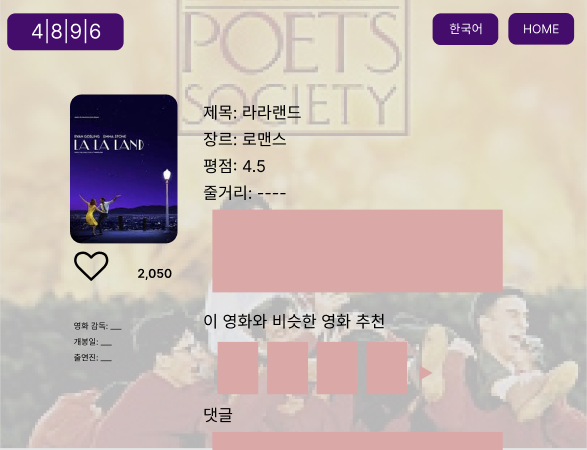

<br>

<br>

## 2. 과정

### 1. Model & ERD

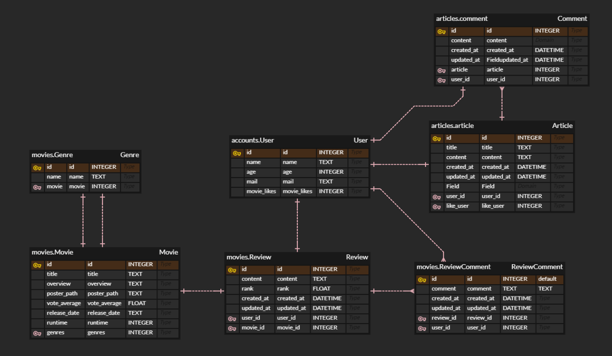

### 2. 영화 데이터 수집

* TMDB를 사용하여 영화 데이터를 가져오고, fixtures로 저장시킴

### 2. Code

#### 1. Django

* 장고 서버의 데이터와 vue의 데이터를 연결 지을 때 가장 중요했던 부분으로 `serializers.py`를 꼽을 수 있다. 이 부분에서 내가 사용할 데이터를 수정할 수 있다. 

  1. account

  ```python
  from rest_framework import serializers
  from django.contrib.auth import get_user_model
  from articles.models import Article
  from movies.models import Movie
  from movies.models import Review
  
  
  class ProfileSerializer(serializers.ModelSerializer):
  
      class ArticleSerializer(serializers.ModelSerializer):
          
          class Meta:
              model = Article
              fields = ('pk', 'title', 'content')
  
      like_articles = ArticleSerializer(many=True)
      articles = ArticleSerializer(many=True)
  
      class MovieSerializer(serializers.ModelSerializer):
  
          class Meta:
              model = Movie
              fields = ('pk', 'title', 'poster_path', 'overview', 'reviews',)
  
      like_movies = MovieSerializer(many=True)
  
      class ReviewSerializer(serializers.ModelSerializer):
  
          class Meta:
              model = Review
              fields = ('pk', 'title',)
  
      # reviews = ReviewSerializer(many=True)
  
      class Meta:
          model = get_user_model()
          fields = ('pk', 'username', 'email', 'like_articles', 'articles', 'like_movies',)
  ```

  2. article

  ```python
  from rest_framework import serializers
  from django.contrib.auth import get_user_model
  
  from ..models import Article
  from .comment import CommentSerializer
  
  User = get_user_model()
  
  
  class ArticleSerializer(serializers.ModelSerializer):
      
      class UserSerializer(serializers.ModelSerializer):
          class Meta:
              model = User
              fields = ('pk', 'username')
  
      comments = CommentSerializer(many=True, read_only=True)
      user = UserSerializer(read_only=True)
      like_users = UserSerializer(read_only=True, many=True)
  
      class Meta:
          model = Article
          fields = ('pk', 'user', 'title', 'content', 'comments', 'like_users')
  
  
  # Article List Read
  class ArticleListSerializer(serializers.ModelSerializer):
      class UserSerializer(serializers.ModelSerializer):
          class Meta:
              model = User
              fields = ('pk', 'username')
  
      user = UserSerializer(read_only=True)
      comment_count = serializers.IntegerField()
      like_count = serializers.IntegerField()
  
      class Meta:
          model = Article
          fields = ('pk', 'user', 'title', 'comment_count', 'like_count')
  
  ```

  3. comment

  ```python
  from rest_framework import serializers
  from django.contrib.auth import get_user_model
  from ..models import Comment
  
  User = get_user_model()
  
  class CommentSerializer(serializers.ModelSerializer):
      
      class UserSerializer(serializers.ModelSerializer):
          class Meta:
              model = User
              fields = ('pk', 'username')
  
      user = UserSerializer(read_only=True)
  
      class Meta:
          model = Comment
          fields = ('pk', 'user', 'content', 'article',)
          read_only_fields = ('article', )
  ```

  4. movies

  ```python
  from rest_framework import serializers
  from django.contrib.auth import get_user_model
  from articles.serializers.article import User
  from .models import Genre, Movie, Review, ReviewComment
  
  User = get_user_model()
  
  # MovieList
  class MovieListSerializer(serializers.ModelSerializer):
  
      class Meta:
          model = Movie
          fields = '__all__'
  
  # GenreList
  class GenreSerializer(serializers.ModelSerializer):
  
      class Meta:
          model = Genre
          fields = '__all__'
          
  
  # Review
  class ReviewSerializer(serializers.ModelSerializer):
  
      class UserSerializer(serializers.ModelSerializer):
          class Meta:
              model = User
              fields = ('pk', 'username')
  
      user = UserSerializer(read_only=True)
  
      class Meta:
          model = Review
          fields = ('pk', 'user', 'content', 'movie','rank',)
          read_only_fields = ('movie','rank','title',)
  
  
  # Movie
  class MovieSerializer(serializers.ModelSerializer):
  
      reviews = ReviewSerializer(many=True, read_only=True)
  
      class Meta:
          model = Movie
          fields = ('pk', 'title', 'overview', 'poster_path', 'vote_average', 'release_date', 'runtime', 'popularity', 'genre', 'adult', 'reviews','like_users' )
          read_only_fields = ('like_users',)
  
  
  # ReviewList
  class ReviewListSerializer(serializers.ModelSerializer):
    movie_title = serializers.SerializerMethodField()
    username = serializers.SerializerMethodField()
    
    def get_movie_title(self, obj):
      return obj.movie.title
    
    def get_username(self, obj):
      return obj.user.username
  
    class Meta:
      model = Review
      fields = ('id', 'user', 'username', 'title', 'content', 'movie_id', 'movie_title', 'rank', 'created_at', 'updated_at',)
      read_only_fields = ('user',)
  
  
  # ReviewComment
  class ReviewCommentSerializer(serializers.ModelSerializer):
    username = serializers.SerializerMethodField()
    
    def get_username(self,obj):
      return obj.user.username
  
    class Meta:
      model = ReviewComment
      fields = ('id', 'user', 'username', 'user', 'content', 'review', 'created_at', 'updated_at',)
      read_only_fields = ('user', 'review',)
  ```

#### 2. Vue

* vue에서 가장 중요한 부분은 `store`이다. 'accounts.js'와 'articles_movies.js' 부분을 나누어 진행했다. props와 $emit을 통한 데이터 관리보다 간편하고 수정도 쉽다. 

  1. accounts.js

  ```js
  import router from '@/router'
  import axios from 'axios'
  import drf from '@/api/drf'
  
  
  export default {
    // namespaced: true,
  
    // state는 직접 접근하지 않겠다!
    state: {
      token: localStorage.getItem('token') || '' ,
      currentUser: {},
      profile: {},
      authError: null,
    },
    // 모든 state는 getters 를 통해서 접근하겠다.
    getters: {
      isLoggedIn: state => !!state.token,
      currentUser: state => state.currentUser,
      profile: state => state.profile,
      authError: state => state.authError,
      authHeader: state => ({ Authorization: `Token ${state.token}`})
    },
  
    mutations: {
      SET_TOKEN: (state, token) => state.token = token,
      SET_CURRENT_USER: (state, user) => state.currentUser = user,
      SET_PROFILE: (state, profile) => state.profile = profile,
      SET_AUTH_ERROR: (state, error) => state.authError = error
    },
  
    actions: {
      saveToken({ commit }, token) {
        /* 
        state.token 추가 
        localStorage에 token 추가
        */
        commit('SET_TOKEN', token)
        localStorage.setItem('token', token)
      },
  
      removeToken({ commit }) {
        /* 
        state.token 삭제
        localStorage에 token 추가
        */
        commit('SET_TOKEN', '')
        localStorage.setItem('token', '')
      },
  
      login({ commit, dispatch }, credentials) {
        /* 
        POST: 사용자 입력정보를 login URL로 보내기
          성공하면
            응답 토큰 저장
            현재 사용자 정보 받기
            메인 페이지(ArticleListView)로 이동
          실패하면
            에러 메시지 표시
        */
        axios({
          url: drf.accounts.login(),
          method: 'post',
          data: credentials
        })
          .then(res => {
            const token = res.data.key
            dispatch('saveToken', token)
            dispatch('fetchCurrentUser')
            router.push({ name: 'movies' })
          })
          .catch(err => {
            console.error(err.response.data)
            commit('SET_AUTH_ERROR', err.response.data)
          })
      },
  
      signup({ commit, dispatch }, credentials) {
        /* 
        POST: 사용자 입력정보를 signup URL로 보내기
          성공하면
            응답 토큰 저장
            현재 사용자 정보 받기
            메인 페이지(ArticleListView)로 이동
          실패하면
            에러 메시지 표시
        */
        axios({
          url: drf.accounts.signup(),
          method: 'post',
          data: credentials
        })
          .then(res => {
            const token = res.data.key
            dispatch('saveToken', token)
            dispatch('fetchCurrentUser')
            router.push({ name: 'articles' })
          })
          .catch(err => {
            console.error(err.response.data)
            commit('SET_AUTH_ERROR', err.response.data)
          })
      },
  
      logout({ getters, dispatch }) {
        /* 
        POST: token을 logout URL로 보내기
          성공하면
            토큰 삭제
            사용자 알람
            LoginView로 이동
          실패하면
            에러 메시지 표시
        */
        axios({
          url: drf.accounts.logout(),
          method: 'post',
          // data: {},
          headers: getters.authHeader,
        })
          .then(() => {
            dispatch('removeToken')
            alert('성공적으로 logout!')
            router.push({ name: 'login' })
          })
          .error(err => {
            console.error(err.response)
          })
      },
  
      fetchCurrentUser({ commit, getters, dispatch }) {
        /*
        GET: 사용자가 로그인 했다면(토큰이 있다면)
          currentUserInfo URL로 요청보내기
            성공하면
              state.cuurentUser에 저장
            실패하면(토큰이 잘못되었다면)
              기존 토큰 삭제
              LoginView로 이동
        */
        if (getters.isLoggedIn) {
          axios({
            url: drf.accounts.currentUserInfo(),
            method: 'get',
            headers: getters.authHeader,
          })
            .then(res => commit('SET_CURRENT_USER', res.data))
            .catch(err => {
              if (err.response.status === 401) {
                dispatch('removeToken')
                router.push({ name: 'login' })
              }
            })
        }
      },
  
      fetchProfile({ commit, getters }, { username }) {
        /*
        GET: profile URL로 요청보내기
          성공하면
            state.profile에 저장
        */
        axios({
          url: drf.accounts.profile(username),
          method: 'get',
          headers: getters.authHeader,
        })
          .then(res => {
            commit('SET_PROFILE', res.data)
            console.log(res.data)
          })
          .catch(err => console.error(err.response))
      },
    },
  }
  
  ```

  2. articles_movies.js

  ```js
  import axios from 'axios'
  import drf from '@/api/drf'
  import router from '@/router'
  
  
  import _ from 'lodash'
  // import accounts from './accounts'
  
  export default {
    // namespaced: true,
    state: {
      articles: [],
      article: {},
  
      movies: [],
      movie: {},
      popularmovies: [],
      shortmovies: [],
      longmovies: [],
      adultmovies: [],
      timemovies: [],
  
      genres: [],
    },
  
    getters: {
      movies: state => state.movies,
      movie: state => state.movie,
      popularmovies: state => state.popularmovies,
      shortmovies: state => state.shortmovies,
      longmovies: state => state.longmovies,
      adultmovies: state => state.aultmovies,
      timemovies: state => state.timemovies,
  
      genres: state => state.genres,
  
  
      articles: state => state.articles,
      article: state => state.article,
      isAuthor: (state, getters) => {
        return state.article.user?.username === getters.currentUser.username
      },
      isArticle: state => !_.isEmpty(state.article),
    },
  
    mutations: {
      SET_MOVIES: (state, movies) => state.movies = movies,
      SET_MOVIE: (state, movie) => state.movie = movie,
      SET_MOVIE_REVIEWS: (state, reviews) => (state.movie.reviews = reviews),
      SET_POPULAR_MOVIES: (state, movies) => state.popularmovies = movies,
      SET_SHORT_MOVIES: (state, movies) => state.shortmovies = movies,
      SET_LONG_MOVIES: (state, movies) => state.longmovies = movies,
      SET_NOW_MOVIES: (state, movies) => state.timemovies = movies,
      // SET_VIDEOS: (state, videos) => state.videos = videos,
  
      SET_GENRES: (state, genres) => state.genres = genres,
  
      SET_ARTICLES: (state, articles) => state.articles = articles,
      SET_ARTICLE: (state, article) => state.article = article,
      SET_ARTICLE_COMMENTS: (state, comments) => (state.article.comments = comments),
    },
    
    actions: {
      fetchArticles({ commit, getters }) {
        /* 게시글 목록 받아오기
        GET: articles URL (token)
          성공하면
            응답으로 받은 게시글들을 state.articles에 저장
          실패하면
            에러 메시지 표시
        */
        axios({
          url: drf.articles.articles(),
          method: 'get',
          headers: getters.authHeader,
        })
          .then(res => {
            console.log(res.data)
            commit('SET_ARTICLES', res.data)
          })
          .catch(err => console.error(err.response))
      },
  
      fetchArticle({ commit, getters }, articlePk) {
        /* 단일 게시글 받아오기
        GET: article URL (token)
          성공하면
            응답으로 받은 게시글들을 state.articles에 저장
          실패하면
            단순 에러일 때는
              에러 메시지 표시
            404 에러일 때는
              NotFound404 로 이동
        */
        axios({
          url: drf.articles.article(articlePk),
          method: 'get',
          headers: getters.authHeader,
        })
          .then(res => {
            console.log(res.data)
            commit('SET_ARTICLE', res.data)
          })
          .catch(err => {
            console.error(err.response)
            if (err.response.status === 404) {
              router.push({ name: 'NotFound404' })
            }
          })
      },
  
      getMovies({ commit, getters }) {
        /* 영화 목록 받아오기
        GET: movies URL (token)
          성공하면
            응답으로 받은 게시글들을 state.movies에 저장
          실패하면
            에러 메시지 표시
        */
        axios({
          url: drf.movies.movies(),
          method: 'get',
          headers: getters.authHeader,
        })
          .then(res => {
              console.log(res.data)
              commit('SET_MOVIES', res.data)
          })
          .catch(err => console.error(err.response))
      },
      getMovie({ commit, getters }, moviePk) {
        /* 단일 영화 받아오기
        GET: movie URL (token)
          성공하면
            응답으로 받은 게시글들을 state.movies에 저장
          실패하면
            단순 에러일 때는
              에러 메시지 표시
            404 에러일 때는
              NotFound404 로 이동
        */
        axios({
          url: drf.movies.movie(moviePk),
          method: 'get',
          headers: getters.authHeader,
        })
          .then(res => {
              console.log(res.data)
              commit('SET_MOVIE', res.data)
          })
          .catch(err => {
            console.error(err.response)
            if (err.response.status === 404) {
              router.push({ name: 'NotFound404' })
            }
          })
      },
  
      getGenres({commit, getters}) {
        /*
        영화 장르 데이터 가져오기
        */
        axios({
          url:drf.movies.genres(),
          method:'get',
          headers: getters.authHeader,
        })
          .then(res => {
            console.log(res.data)
            commit('SET_GENRES', res.data)
          })
          .catch(err => console.error(err.response))
  
      },
  
      recommendMovies({ commit, getters }) {
        /* 추천영화 목록 받아오기
          성공하면
            응답으로 받은 게시글들을 state.movies에 저장
          실패하면
            에러 메시지 표시
        */
  
        axios({
          url: drf.movies.recommend(),
          method: 'post',
          headers: getters.authHeader,
        })
          .then(res => {
              console.log(res.data)
              commit('SET_SHORT_MOVIES', res.data[0])
              commit('SET_LONG_MOVIES', res.data[1])
              commit('SET_POPULAR_MOVIES', res.data[2])
              commit('SET_NOW_MOVIES', res.data[3])
            })
          .catch(err => console.error(err.response))
      },
  
      createArticle({ commit, getters }, article) {
        /* 게시글 생성
        POST: articles URL (게시글 입력정보, token)
          성공하면
            응답으로 받은 게시글을 state.article에 저장
            ArticleDetailView 로 이동
          실패하면
            에러 메시지 표시
        */
        
        axios({
          url: drf.articles.articles(),
          method: 'post',
          data: article,
          headers: getters.authHeader,
        })
          .then(res => {
            commit('SET_ARTICLE', res.data)
            router.push({
              name: 'article',
              params: { articlePk: getters.article.pk }
            })
          })
      },
  
      updateArticle({ commit, getters }, { pk, title, content}) {
        /* 게시글 수정
        PUT: article URL (게시글 입력정보, token)
          성공하면
            응답으로 받은 게시글을 state.article에 저장
            ArticleDetailView 로 이동
          실패하면
            에러 메시지 표시
        */
        axios({
          url: drf.articles.article(pk),
          method: 'put',
          data: { title, content },
          headers: getters.authHeader,
        })
          .then(res => {
            commit('SET_ARTICLE', res.data)
            router.push({
              name: 'article',
              params: { articlePk: getters.article.pk }
            })
          })
      },
  
      deleteArticle({ commit, getters }, articlePk) {
        /* 게시글 삭제
        사용자가 확인을 받고
          DELETE: article URL (token)
            성공하면
              state.article 비우기
              AritcleListView로 이동
            실패하면
              에러 메시지 표시
        */
        
        if (confirm('정말 삭제하시겠습니까?')) {
          axios({
            url: drf.articles.article(articlePk),
            method: 'delete',
            headers: getters.authHeader,
          })
            .then(() => {
              commit('SET_ARTICLE', {})
              router.push({ name: 'articles' })
            })
            .catch(err => console.error(err.response))
        }
      },
  
      likeArticle({ commit, getters }, articlePk) {
        /* 게시글 좋아요
        POST: likeArticle URL(token)
          성공하면
            state.article 갱신
          실패하면
            에러 메시지 표시
        */
        axios({
          url: drf.articles.likeArticle(articlePk),
          method: 'post',
          headers: getters.authHeader,
        })
          .then(res => commit('SET_ARTICLE', res.data))
          .catch(err => console.error(err.response))
      },
  
      likeMovie({ commit, getters }, moviePk) {
        /* 영화 좋아요
        POST: likeMovie URL(token)
          성공하면 
          state.movie 갱신
        실패하면
          에러 메시지 표시
        */
        axios({
          url: drf.movies.likeMovie(moviePk),
          method: 'post',
          headers: getters.authHeader,
        })
          .then(res => {
            console.log(res.data)
            commit('SET_MOVIE', res.data)
          })
          .catch(err => console.error(err.response))
      },
  
  		createComment({ commit, getters }, { articlePk, content }) {
        /* 댓글 생성
        POST: comments URL(댓글 입력 정보, token)
          성공하면
            응답으로 state.article의 comments 갱신
          실패하면
            에러 메시지 표시
        */
        const comment = { content }
  
        axios({
          url: drf.articles.comments(articlePk),
          method: 'post',
          data: comment,
          headers: getters.authHeader,
        })
          .then(res => {
            console.log(res.data)
            commit('SET_ARTICLE_COMMENTS', res.data)
          })
          .catch(err => console.error(err.response))
      },
  
      updateComment({ commit, getters }, { articlePk, commentPk, content }) {
        /* 댓글 수정
        PUT: comment URL(댓글 입력 정보, token)
          성공하면
            응답으로 state.article의 comments 갱신
          실패하면
            에러 메시지 표시
        */
        const comment = { content }
  
        axios({
          url: drf.articles.comment(articlePk, commentPk),
          method: 'put',
          data: comment,
          headers: getters.authHeader,
        })
          .then(res => {
            commit('SET_ARTICLE_COMMENTS', res.data)
          })
          .catch(err => console.error(err.response))
      },
  
      deleteComment({ commit, getters }, { articlePk, commentPk }) {
        /* 댓글 삭제
        사용자가 확인을 받고
          DELETE: comment URL (token)
            성공하면
              응답으로 state.article의 comments 갱신
            실패하면
              에러 메시지 표시
        */
          if (confirm('정말 삭제하시겠습니까?')) {
            axios({
              url: drf.articles.comment(articlePk, commentPk),
              method: 'delete',
              data: {},
              headers: getters.authHeader,
            })
              .then(res => {
                commit('SET_ARTICLE_COMMENTS', res.data)
              })
              .catch(err => console.error(err.response))
          }
        },
  
        createReview({ commit, getters }, { moviePk, content }) {
          /* 리뷰 생성
          POST: reviews URL(리뷰 입력 정보, token)
            성공하면
              응답으로 state.movie의 reviews 갱신
            실패하면
              에러 메시지 표시
          */
          const review = { content }
    
          axios({
            url: drf.movies.reviews(moviePk),
            method: 'post',
            data: review,
            headers: getters.authHeader,
          })
            .then(res => {
              console.log(res.data)
              commit('SET_MOVIE_REVIEWS', res.data)
            })
            .catch(err => console.error(err.response))
        },
  
        updateReview({ commit, getters }, { moviePk, reviewPk, content }) {
          /* 리뷰 수정
          PUT: review URL(댓글 입력 정보, token)
            성공하면
              응답으로 state.article의 comments 갱신
            실패하면
              에러 메시지 표시
          */
          const review = { content }
    
          axios({
            url: drf.movies.review(moviePk, reviewPk),
            method: 'put',
            data: review,
            headers: getters.authHeader,
          })
            .then(res => {
              commit('SET_MOVIE_REVIEWS', res.data)
            })
            .catch(err => console.error(err.response))
        },
    
        deleteReview({ commit, getters }, { moviePk, reviewPk }) {
          /* 리뷰 삭제
          사용자가 확인을 받고
            DELETE: review URL (token)
              성공하면
                응답으로 state.movie의 reviews 갱신
              실패하면
                에러 메시지 표시
          */
            if (confirm('정말 삭제하시겠습니까?')) {
              axios({
                url: drf.movies.review(moviePk, reviewPk),
                method: 'delete',
                data: {},
                headers: getters.authHeader,
              })
                .then(res => {
                  commit('SET_MOVIE_REVIEWS', res.data)
                })
                .catch(err => console.error(err.response))
            }
          },
    },
  }
  
  ```

<br>

## 3. 결과

### 1. 결과 사진

[완성된 결과 사진]

1. movies

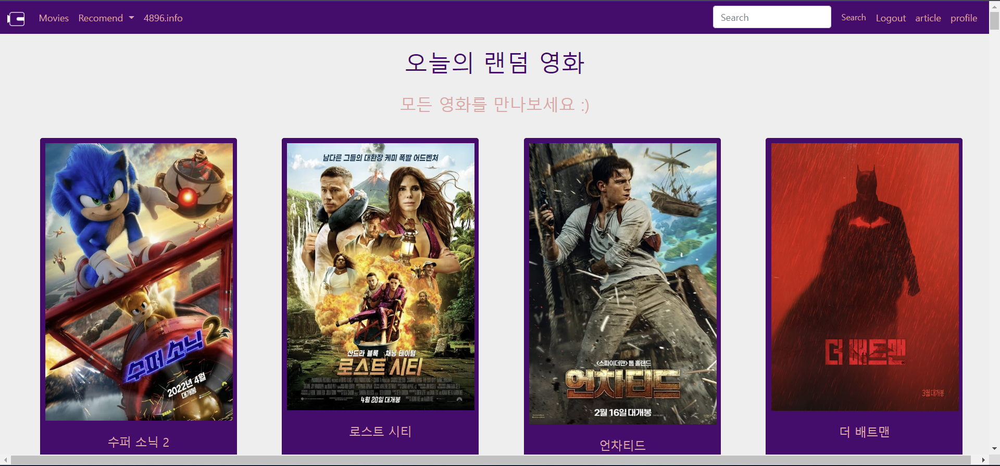

2. movie detail

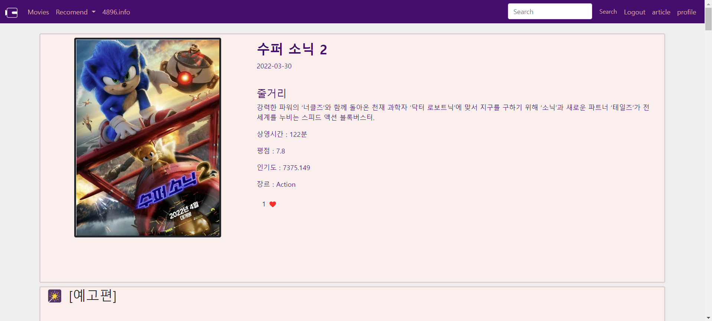


3. recommend (현재 네가지의 추천 기능 제공)

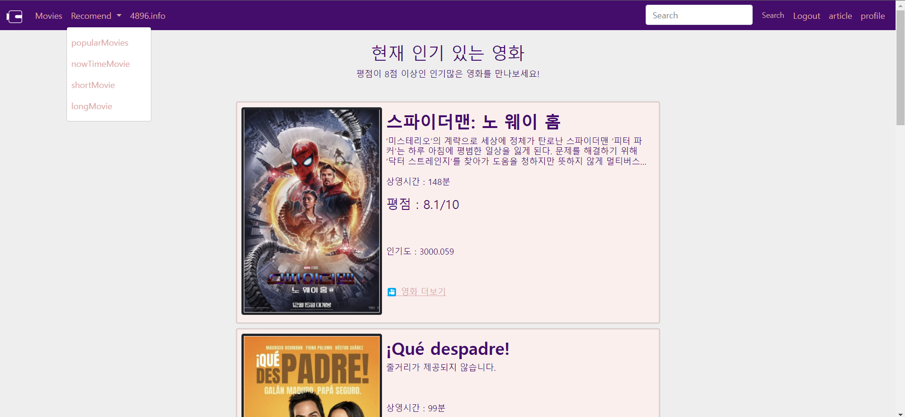


4. info

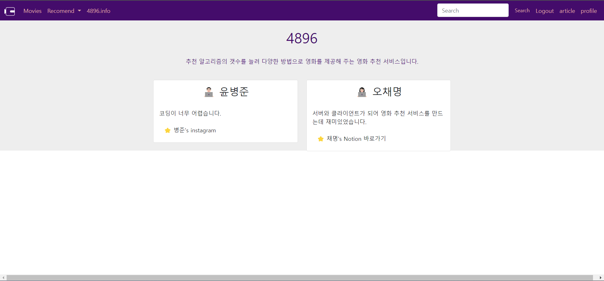

5. login

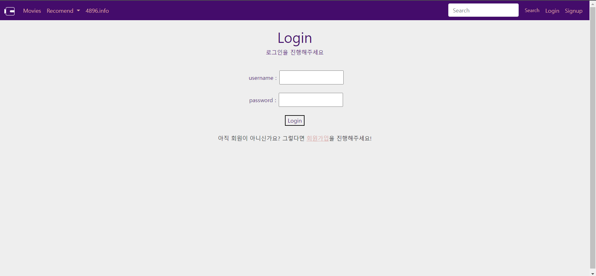

6. signup


7. profile

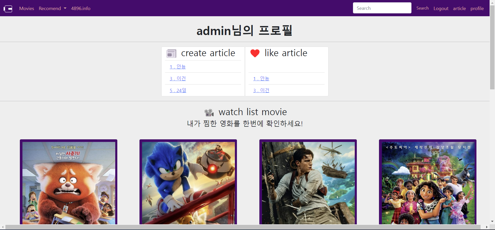

### 2. 총평

:girl: 오채명

* 프로젝트에서 가장 신경써서 작업하고 싶었던 부분은 UI 였다. Vuex를 사용한 프론트 엔드 작업을 가장 기대했고, 신경써서 작업해야 겠다고 생각하며 코드를 작성했다. 

아쉬웠던 점 : 우선 DB를 토대로 vue에서 부트스트랩을 사용하였는데 넓이, 길이, 색감을 조정하고,  row와 col을 오랜만에 사용해봐서 그런지 처음에 어려움이 많았다. 하지만 여러번 사용해보며 점차 손에 익어가는 것이 재미있었다. 

 두 번째는 django 코드와 vue 코드를 왓다갓다하며 수정하는 부분이 어려웠다. 만약 프로필 페이지에서 사용하고 싶은 정보가 있다면  'serializers'에서 추가, 삭제를 통해 vue에서 사용할 수 있었다. 이 과정에서 `model`과 `form`, `serializers`를 이해할 수 있게 되어서 좋았다. 

 마지막으로 유투브 예고편을 넣지 못해 아쉬움이 남는다. 유투브 API_KEY는 요청하는 횟수에 제한이 있는데 너무 많이 상요하다 보니 exceeded오류가 발생하였고, 배포나 여러번 사용 하는 과정에서 오류가 날 것을 대비해 직접적으로 보여줄 수 없다는 부분이 아쉬웠다. 

일주일간의 프로젝트를 하기 전에는 할 수 없을 것 만 같던 모든 과정들이 재미로 다가왔다는 점이 가장 좋은 것 같다. 페어의 도움이 얼마나 크게 느껴지는지 알았고, 협업을 하는 과정을 알게 되어서 좋았던 것 같다. 이학기 프로젝트에서는 서버에도 많이 신경 쓰고 특히, 프론트 엔드부분에서 더 완벽하게 만들고 싶다는 욕심이 들었다. 


:boy: 윤병준

